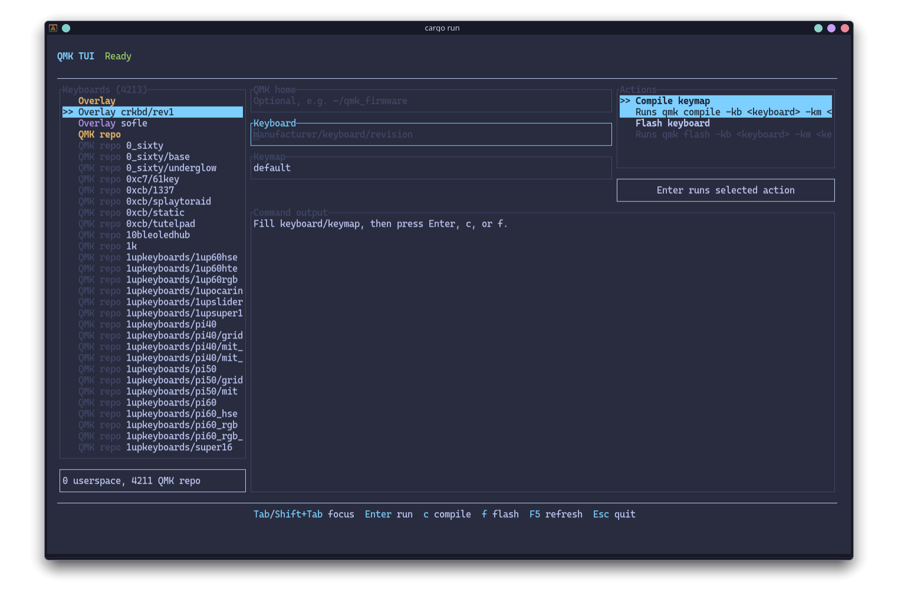

# qmk-tui

`qmk-tui` is a Rust/Ratatui terminal UI for common QMK keyboard workflows.

## Features

- Edit QMK firmware path, keyboard, and keymap from the TUI.
- Browse keyboards in a sidebar, with userspace keyboards listed before QMK repo keyboards.
- Select a keyboard from the sidebar and copy it into the `Keyboard` field.
- Run `qmk compile -kb <keyboard> -km <keymap>`.
- Run `qmk flash -kb <keyboard> -km <keymap>`.
- See command status, stdout, and stderr without leaving the app.
- Run QMK commands in a background worker so the terminal UI stays responsive.

## Requirements

- Rust toolchain.
- QMK CLI installed and available as `qmk` in `PATH`.
- A local `qmk_firmware` checkout, usually at `~/qmk_firmware`.

## Usage

```bash
cargo run
```

You can prefill the form:

```bash
cargo run -- --qmk-home ~/qmk_firmware --keyboard splitkb/kyria/rev3 --keymap default
```

Keyboard shortcuts:

- `Tab` / `Shift+Tab`: move focus.
- `Up` / `Down`: move through actions or keyboard list.
- `Enter`: run the selected action, or select the highlighted keyboard when the sidebar is focused.
- `c`: compile when the action list is focused.
- `f`: flash when the action list is focused.
- `F5` or `r`: refresh the keyboard list.
- `Esc` or `Ctrl+C`: quit.

## Architecture

- `app.rs`: application state, keyboard handling, workflow orchestration.
- `qmk.rs`: QMK command validation, argument building, and process execution.
- `ui.rs`: Ratatui rendering only.
- `terminal.rs`: Crossterm/Ratatui terminal lifecycle.
- `cli.rs`: startup arguments with Clap.

## Preview


